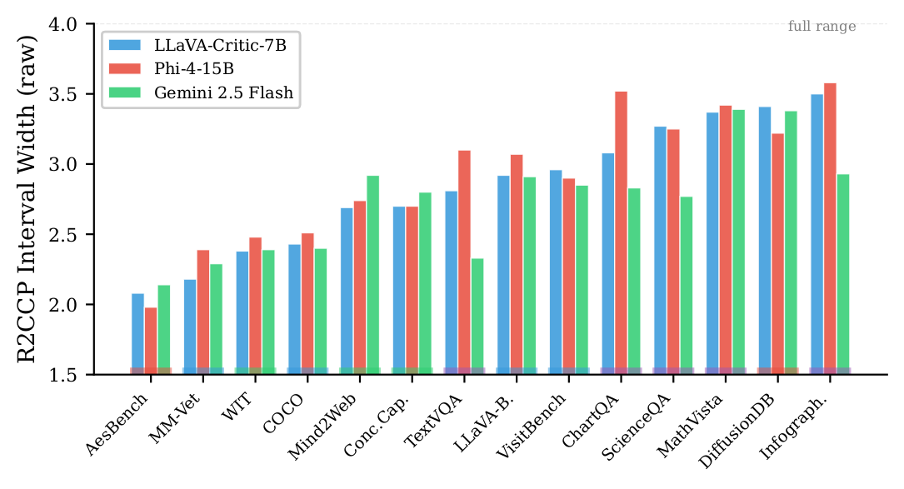
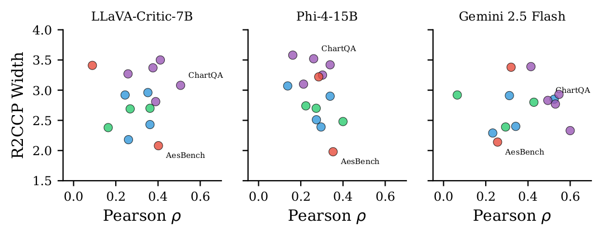
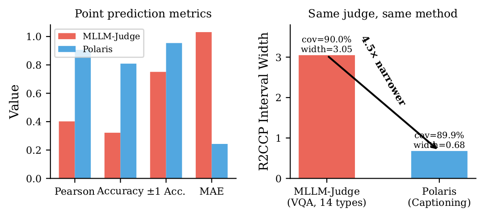
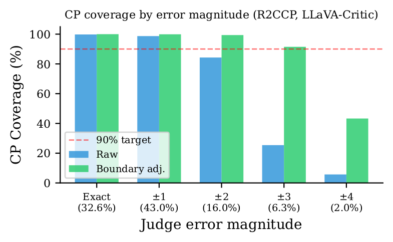

# VLM-Judge-Uncertainty

> **VLM Judges Can Rank but Cannot Score: Task-Dependent Uncertainty in Multimodal Evaluation.**
> A distribution-free framework that turns Vision-Language-Model (VLM) judge scores into calibrated prediction intervals with provable coverage guarantees, using only score-token log-probabilities and no retraining.

<p align="center">
  <a href="#paper">📄 Paper</a> &nbsp;•&nbsp;
  <a href="#key-results">📊 Results</a> &nbsp;•&nbsp;
  <a href="#installation">⚙️ Installation</a> &nbsp;•&nbsp;
  <a href="#reproducing-the-paper">🔁 Reproducing</a> &nbsp;•&nbsp;
  <a href="#repository-structure">📁 Structure</a> &nbsp;•&nbsp;
  <a href="#citation">📑 Citation</a>
</p>

---

## TL;DR

VLM judges (LLaVA-Critic, Phi-4, Gemini, …) are increasingly used to evaluate multimodal AI systems, but their point scores carry **no indication of reliability**. We attach a **conformal prediction wrapper** to existing judges that produces calibrated prediction intervals at a user-chosen confidence level (e.g. 90%), with three new findings:

1. **Task-dependent uncertainty.** Interval width varies up to **70% across 14 visual task categories** — narrow on aesthetics, wide on charts/math/infographics. The same effect holds across 3 different judges.
2. **Ranking-scoring decoupling.** A judge can rank responses well (high Pearson correlation) while producing wide, uninformative intervals — a failure mode invisible to standard metrics.
3. **Data quality dominates.** Same judge, same method: intervals are **4.5× narrower** on a clean multi-annotator captioning benchmark (Polaris) than on noisy single-annotator data (MLLM-Judge).

The intervals are valid (≥90% coverage), informative (interval width is a usable reliability signal), and require no retraining of the underlying judge.

---

## Paper

📄 **Read the paper on arXiv:** [arxiv.org/abs/2604.25235](https://arxiv.org/abs/2604.25235)

**Authors:** Divake Kumar¹, Sina Tayebati¹, Devashri Naik¹, Ranganath Krishnan², Amit Ranjan Trivedi¹
¹ University of Illinois at Chicago &nbsp;&nbsp; ² AI Labs at Capital One

---

## Key Results

### Task-dependent interval width

Interval width is determined primarily by the *task*, not the *judge*. Spearman rank-correlation of per-dataset widths between judges is 0.82–0.93.

<p align="center">
  
</p>

### Ranking-scoring decoupling

Datasets in the upper-right quadrant (high correlation, wide intervals) are the decoupling cases — judges rank correctly but cannot assign reliable absolute scores.

<p align="center">
  
</p>

### Data quality dominates: MLLM-Judge vs. Polaris

| Group | Metric | MLLM-Judge (14 tasks, 1 annotator) | Polaris (Captioning, multi-annotator) |
|---|---|---|---|
| Data | Samples | 5,717 | 8,726 |
| | GT type | 1 annotator, integer | 3+ annotators, averaged |
| Point | Pearson ρ | .402 | **.906** |
| | Exact accuracy | 32.2% | **80.9%** |
| | MAE | 1.031 | **0.243** |
| R2CCP | Coverage | .900 | .899 |
| | **Width** | 3.05 (61% of scale) | **0.68 (14%)** |

<p align="center">
  
</p>

### Conformal prediction recovers 97.8% of judge errors

Boundary-adjusted CP coverage stays above 99% on the ±1 and ±2 error bins (which together cover 59% of samples).

<p align="center">
  
</p>

### Cross-judge headline numbers

| Method | LLaVA-Critic-7B | Phi-4-15B | Gemini 2.5 Flash |
|---|:---:|:---:|:---:|
| Pearson ρ | .402 | .303 | **.459** |
| ±1 Accuracy | 75.1% | **76.1%** | 70.3% |
| R2CCP coverage | .900 | .891 | .898 |
| R2CCP width (raw) | 3.05 | 3.13 | **2.85** |
| R2CCP width (boundary-adjusted) | 3.60 | 3.70 | **3.41** |

All numbers reported as mean over 10 random calibration/test splits at α = 0.10.

---

## Method at a Glance

```
                    ┌──────────────────────────┐
   image + prompt ──▶│   VLM Judge (frozen)     │── score: "Score: X"
                    └──────────────────────────┘
                                │
                                ▼
        score-token logprobs:  [logP("1"), logP("2"), …, logP("5")]   (5-dim)
                                │
                                ▼
                    ┌──────────────────────────┐
                    │   Conformal Predictor    │   (R2CCP / CHR / …)
                    │   trained on calibration │
                    │   set with human GT      │
                    └──────────────────────────┘
                                │
                                ▼
              [lower, upper]   prediction interval at confidence 1−α
              ⌈lower⌉, ⌊upper⌋  boundary-adjusted to integer Likert
```

Three pieces, all post-hoc and distribution-free:

1. **Run any judge VLM** with `output_scores=True` and capture the logits at the score-token position.
2. **Extract a 5-dim feature vector** of log-probabilities for tokens "1"–"5".
3. **Calibrate** a conformal predictor on a held-out set with human ground truth, then apply at test time. We compare 8 conformal methods; **R2CCP** is our default.

---

## Models and Datasets

### Judges (Vision-Language Models used in this paper)

| Model | HuggingFace ID / Provider | Size | Access | Notes |
|---|---|---|---|---|
| **LLaVA-Critic-7B** | [`lmms-lab/llava-critic-7b`](https://huggingface.co/lmms-lab/llava-critic-7b) | 7B | open | Evaluation-specialized; primary judge |
| **Phi-4-reasoning-vision** | [`microsoft/Phi-4-reasoning`](https://huggingface.co/microsoft/Phi-4-reasoning) | 15B | open | Long chain-of-thought reasoning |
| **Gemini 2.5 Flash** | Google Vertex AI (`gemini-2.5-flash`) | — | API | Closed-source; logprobs via Vertex |

**Download (HuggingFace).**
```bash
huggingface-cli download lmms-lab/llava-critic-7b      --local-dir models/llava-critic-7b
huggingface-cli download microsoft/Phi-4-reasoning     --local-dir models/Phi-4-reasoning
```

**Gemini setup (Vertex AI).**
```bash
gcloud auth application-default login
gcloud auth application-default set-quota-project YOUR_PROJECT_ID
export VERTEXAI_PROJECT="YOUR_PROJECT_ID"
export VERTEXAI_LOCATION="us-central1"
```

### Datasets

| Dataset | Source | Size | GT | Used For |
|---|---|---|---|---|
| **MLLM-as-a-Judge** | [`Dongping-Chen/MLLM-Judge`](https://github.com/Dongping-Chen/MLLM-Judge) | 5,717 instances, 14 task categories | 1 annotator, 1–5 Likert | Main paper |
| **Polaris** | [Wada et al. 2024](https://arxiv.org/abs/2402.18091) | 8,726 image–caption pairs | 3+ annotators, averaged → 1–5 | Data-quality contrast |

**Download.**
```bash
# MLLM-as-a-Judge: clone the dataset repo and place under data/mllm_judge/
git clone https://github.com/Dongping-Chen/MLLM-Judge data/mllm_judge

# Polaris: official release; see scripts/download_data.py for our exact pipeline
python scripts/download_data.py --dataset polaris --out data/polaris
```

Licensing: MLLM-Judge is CC-BY-NC; Polaris is CC-BY-4.0; LLaVA-Critic is Apache-2.0; Phi-4 is MIT. Gemini access is governed by Google Vertex AI's commercial terms.

---

## Installation

### Hardware

The paper's open-source experiments use **2× NVIDIA RTX 6000 Ada (48 GB each)**. Phi-4-15B fits in fp16 across the two GPUs via `device_map="auto"`. LLaVA-Critic-7B fits on a single 24 GB GPU. Gemini inference is API-based and uses no local GPU.

Conformal calibration alone (given pre-extracted features) runs in under 10 minutes per judge on a single CPU core.

### Software

The pipeline uses two conda environments because LLaVA-Critic and Phi-4 require different `transformers` versions.

```bash
# Main environment (LLaVA-Critic, conformal calibration, analysis)
conda create -n env_py311 python=3.11 -y
conda activate env_py311

pip install -r requirements.txt
pip install R2CCP-0.0.8-py3-none-any.whl --no-deps   # required wheel
pip install litellm                                  # for Gemini access
```

```bash
# Phi-4 environment (needs transformers>=4.57.1 for Siglip2VisionModel)
conda create -n phi4_env python=3.11 -y
conda activate phi4_env

pip install "transformers>=4.57.1" torch==2.5.1 accelerate Pillow
pip install -r requirements.txt
```

**Critical version pin:** `mapie==0.8.6` is required. MAPIE 1.x renames `MapieQuantileRegressor` and breaks the CQR variants reported in the paper.

---

## Quick Start

Score a single (image, response) with calibrated 90% prediction interval:

```python
from src.models.llava import LlavaCriticJudge
from src.signals.extractor import extract_score_logprobs
from src.conformal.runner import load_calibrated_r2ccp

judge = LlavaCriticJudge.from_pretrained("models/llava-critic-7b")

score_str, logits = judge.score(
    image="path/to/image.jpg",
    question="Describe the chart.",
    answer="The chart shows a steady increase from 2020 to 2024.",
)
features = extract_score_logprobs(score_str, logits)        # → 5-dim vector

cp = load_calibrated_r2ccp("model_paths/r2ccp_llava_mllm.pt")
lower, upper = cp.predict_interval(features, alpha=0.10)
print(f"Score = {score_str}, 90% CI = [{lower:.2f}, {upper:.2f}]")
```

---

## Reproducing the Paper

The full pipeline is four stages. Each stage saves intermediate artefacts so subsequent stages can run independently.

### Stage 1 — Judge inference (compute-heavy)

```bash
# LLaVA-Critic on MLLM-as-a-Judge
conda activate env_py311
python scripts/run_judge.py \
    --judge llava-critic-7b \
    --dataset mllm_judge \
    --prompt configs/prompts/mllm_judge_cot.yaml \
    --out outputs/llava_mllm.jsonl

# Phi-4 (separate env, longer reasoning chains)
conda activate phi4_env
python scripts/run_judge_phi4.py --dataset mllm_judge --out outputs/phi4_mllm.jsonl

# Gemini 2.5 Flash (Vertex AI)
conda activate env_py311
python scripts/run_judge_gemini.py --dataset mllm_judge --out outputs/gemini_mllm.jsonl

# Polaris equivalents
python scripts/run_judge_polaris.py        --judge llava-critic-7b
python scripts/run_judge_phi4_polaris.py   # Phi-4 think mode
```

**Time budget (10 seeds, full benchmarks):**
LLaVA-Critic ≈ 6 h · Phi-4 ≈ 14 h · Gemini ≈ 3 h (rate-limited).

### Stage 2 — Score-token feature extraction

```bash
python scripts/extract_signals.py \
    --judge_outputs outputs/llava_mllm.jsonl \
    --out results/v2/features_s2.csv
```

This produces a CSV with one row per sample and 5 logprob columns plus the human GT score. Identical for all judges.

### Stage 3 — Conformal calibration (fast)

```bash
# Single method (R2CCP, default)
python scripts/run_conformal.py \
    --features results/v2/features_s2.csv \
    --method r2ccp --alpha 0.10 --n_seeds 10

# All 8 methods compared
python scripts/run_all_conformal.py --features results/v2/features_s2.csv

# Per-dataset breakdown (the 14 MLLM-Judge categories)
python scripts/run_r2ccp_per_dataset.py
```

### Stage 4 — Full analysis & figures

```bash
python scripts/run_full_analysis.py        --judge llava   --out results/v2
python scripts/run_full_analysis_gemini.py --out results/v2_gemini
python scripts/run_full_analysis_phi4.py   --out results/v2_phi4
```

The CSV outputs in `results/v2*/` are exactly the numbers reported in the paper's tables. Aggregated results CSVs are tracked in this repo so reviewers can verify reported numbers without re-running inference.

### Sanity check

After installation:

```bash
python scripts/test_lean_runner.py   # 5-sample smoke test, ~1 minute
```

---

## Repository Structure

```
VLM-Judge-Uncertainty/
├── README.md                       ← this file
├── requirements.txt                ← pip dependencies
├── R2CCP-0.0.8-py3-none-any.whl    ← R2CCP wheel (install with --no-deps)
│
├── src/                            ← library code
│   ├── models/                     ← Judge VLM wrappers (LLaVA-Critic, …)
│   ├── inference/                  ← Actor and judge runners
│   ├── signals/                    ← Score-token logprob extraction
│   ├── conformal/                  ← R2CCP & MLP calibration runner
│   ├── data/                       ← Dataset loaders (MLLM-Judge, Polaris)
│   ├── evaluation/                 ← Pearson, MAE, coverage metrics
│   └── utils/
│
├── scripts/                        ← top-level entry points
│   ├── run_judge.py                  · LLaVA-Critic on MLLM-Judge
│   ├── run_judge_phi4.py             · Phi-4 on MLLM-Judge
│   ├── run_judge_gemini.py           · Gemini 2.5 Flash on MLLM-Judge
│   ├── run_judge_polaris.py          · Polaris variants
│   ├── extract_signals.py            · score-token logprob → CSV
│   ├── run_conformal.py              · single CP method
│   ├── run_all_conformal.py          · 8 methods compared
│   ├── run_r2ccp_per_dataset.py      · per-dataset analysis
│   └── run_full_analysis.py          · paper tables + figures
│
├── conformal_predictors/           ← CP method implementations
│   ├── R2CCP_rancom.py               · default, regression-as-classification
│   ├── CHR_random.py                 · histogram regression
│   ├── CQR_random.py                 · quantile regression
│   ├── BoostedCP_random.py           · boosted variants
│   ├── LVD_random.py                 · locally adaptive variance
│   ├── OrdinalAPS_random.py          · classification-based
│   ├── interval_processing.py        · boundary adjustment
│   └── evaluation_metrics.py         · Pearson/Spearman/Kendall/MSE/MAE
│
├── configs/                        ← YAML configs
│   ├── prompts/                      · CoT and generic scoring prompts
│   ├── models/                       · model load configs
│   ├── datasets/                     · dataset paths
│   └── experiments/                  · pilot configs
│
├── results/                        ← aggregate CSVs (paper numbers)
│   ├── v2/                           · LLaVA-Critic on MLLM-Judge
│   ├── v2_gemini/                    · Gemini on MLLM-Judge
│   ├── v2_phi4/                      · Phi-4 on MLLM-Judge
│   ├── v2_polaris/                   · LLaVA-Critic on Polaris
│   ├── v2_mondrian/                  · Mondrian CP results
│   └── v2_multijudge/                · feature fusion ablation
│
├── paper/                          ← paper sources (LaTeX)
│   └── colm2026/
│       ├── main_arxiv.tex            · arXiv version source
│       ├── references_write_01.bib   · bibliography
│       └── figures/
│
└── assets/                         ← README figures (PNG)
```

---

## License

The code in this repository is released under the **MIT License** (see `LICENSE`). Models and datasets retain their original licenses (see [Models and Datasets](#models-and-datasets)).

---

## Citation

If you use this code or build on this work, please cite:

```bibtex
@misc{kumar2026vlmjudgesrankscore,
      title={VLM Judges Can Rank but Cannot Score: Task-Dependent Uncertainty in Multimodal Evaluation},
      author={Divake Kumar and Sina Tayebati and Devashri Naik and Ranganath Krishnan and Amit Ranjan Trivedi},
      year={2026},
      eprint={2604.25235},
      archivePrefix={arXiv},
      primaryClass={cs.LG},
      url={https://arxiv.org/abs/2604.25235},
}
```

---

## Acknowledgements

This work builds on the conformal prediction toolbox of Sheng et al. (2025) for LLM judges, the MLLM-as-a-Judge benchmark of Chen et al. (2024), the Polaris captioning benchmark of Wada et al. (2024), and the LLaVA-Critic judge model of Xiong et al. (2024). We thank the maintainers of MAPIE and the R2CCP package for the conformal prediction implementations.

---

## Contact

Questions, issues, and suggestions are welcome via GitHub Issues.
For research collaboration: **dkumar33@uic.edu** (Divake Kumar).
